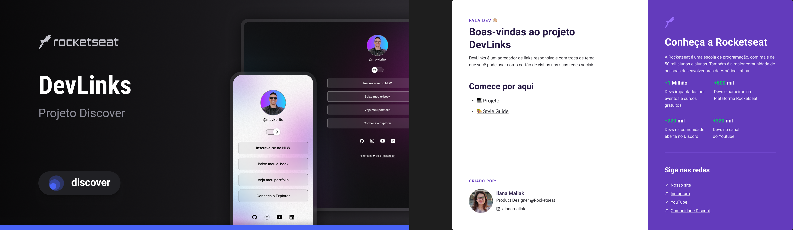

<h1 align="center">DevLinks</>

Programa exclusivo e gratuito, promovido pela Rocketseat para ensino de tecnologias WEB.

  <a href="#-tecnologias">Tecnologias </a>&nbsp;&nbsp;&nbsp;|&nbsp;&nbsp;&nbsp;
  <a href="#-projeto">Projeto </a>&nbsp;&nbsp;&nbsp;|&nbsp;&nbsp;&nbsp;
  <a href="#-layout">Layout</a>&nbsp;&nbsp;&nbsp;|&nbsp;&nbsp;&nbsp;
  <a href="#memo-licença">Licença</a>&nbsp;&nbsp;&nbsp;|&nbsp;&nbsp;&nbsp;

  

 

  

## 🚀Tecnologias

Esse projeto foi desenvolvido com as seguintes tecnologias:

- HTML e CSS
- JavaScript
- Git e Github
- Figma

## 💻Projeto

O DevLinks é um agregador links para usar como cartão de visitas online.

## 📩Layout

Você pode visualizar o projeto através [DESSE LINK](<https://www.figma.com/file/Dl6RiZa6P8N2hHuukeGi8I/DevLinks-%E2%80%A2-Projeto-Discover-(Community)?type=design&node-id=58%3A455&t=cPPL6ipA5lCGwgsy-1>). É necessário ter conta no [FIGMA](https://figma.com) para acessá-lo.

## :memo: Licença

Esse projeto está sob a licença MIT.

---

Feito com ❤ by Bruno Dias :wave: [Acesse meu LinkedIn!](https://www.linkedin.com/in/bruno-dias-custodio-50461b259/)
